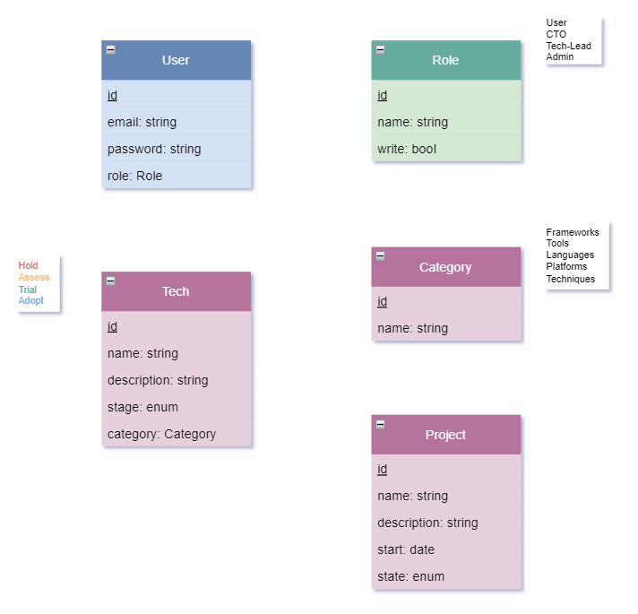

# WEBLAB Projekt
## 1 Einführung und Ziele

Im Modul WEBLAB (Web Programming Lab) an der Hochschule soll ein Web-Projekt mit den behandelten Technologien erarbeitet werden.

Es wird die vorgeschlagene Projektidee eines "Technologie-Radars" verfolgt. Dabei ist das Ziel, dass
innerhalb eines Unternehmens eine Übersicht auf die in Projekten verwendeten Technologien & Tools verschafft wird. In einem einer Visualisierung ähnlich zu einem Radar werden Technologien & Tools als Punkte dargestellt. Über die Quadranten werden diese kategorisiert.

### 1.1 Aufgabenstellung

In Einzelarbeit soll mit einem totalen Aufwand von ca. 60 Stunden ein Web-Projekt realisiert werden. Die Artefakte aus
dem Projekt zu 70% und Präsentation zu 30% ergeben die Modulnote. Gefordert werden folgende Inhalte:

Projekt (70%)
- Architekturdokumentation (35%)
- Fazit & Reflexion (20%)
- Arbeitsjournal (10%)
- Softwareartefakte (35%)

Präsentation (30%)
- Aufbau, Verständlichkeit (30%)
- Präsentationsartefakte (30%, Abgabe nach der Präsentation, Inhalt für 5 Minuten)
- Einhaltung der Timebox 5 Minuten (10%)
- Beantwortung Fragen (30%)

### 1.2 Qualitätsziele

- **Security**: Der Radar ist intern für alle Mitarbeiter verfügbar. Inhalte können nur von spezifischen Rollen (CTO, Tech-Lead, Admin) nach Authentifizierung (E-Mail & Passwort) verändert werden. Sensible Daten wie das Passwort werden nur gehashed abgespeichert.
- **Performance**: Die Inhalte werden unter Normalbedingungen (Kabelgebunden oder 5G) innert 1s geladen.
- **Usability**: Das UI ist für die Geräte Mobile & Desktop optimiert, verwendet ein schlichtes & übersichtliches Design mit auf dem Gerät erwartbarem Verhalten (z.B Navigationsleiste hinter Hamburger-Icon auf Mobile)
- **Traceability**: Anpassungen an den Technologien werden historisiert und Anmeldungen auf der Adminseite protokolliert.

## 2 Kontextabgrenzung

https://github.com/web-programming-lab/web-programming-lab-projekt/blob/main/Technologie-Radar.md

### 2.1 Abgrenzungen / Änderungen
- Projekte

Die Kontextabgrenzung grenzt das System gegen alle Kommunikationspartner
(Nachbarsysteme und Benutzerrollen) ab. Sie legt damit die externen
Schnittstellen fest und zeigt damit auch die Verantwortlichkeit (scope)
Ihres Systems: Welche Verantwortung trägt das System und welche
Verantwortung übernehmen die Nachbarsysteme?

Differenzieren Sie fachlichen (Ein- und Ausgaben) und technischen
Kontext (Kanäle, Protokolle, Hardware), falls nötig.

Verschiedene Optionen:
-   Diverse Kontextdiagramme
-   Listen von Kommunikationsbeziehungen mit deren Schnittstellen

### 2.1 Technischer Kontext

Technische Schnittstellen (Kanäle, Übertragungsmedien) zwischen dem
System und seiner Umwelt. Zusätzlich eine Erklärung (*mapping*), welche
fachlichen Ein- und Ausgaben über welche technischen Kanäle fließen.

Beispielsweise UML Deployment-Diagramme mit den Kanälen zu
Nachbarsystemen, begleitet von einer Tabelle, die Kanäle auf
Ein-/Ausgaben abbildet.

## 3 Lösungsstrategie

Kurzer Überblick über die grundlegenden Entscheidungen und
Lösungsansätze, die Entwurf und Implementierung des Systems prägen.
Hierzu gehören:

-   Technologieentscheidungen
-   Entscheidungen über die Top-Level-Zerlegung des Systems,
    beispielsweise die Verwendung gesamthaft prägender Entwurfs- oder
    Architekturmuster,
-   Entscheidungen zur Erreichung der wichtigsten Qualitätsanforderungen
    sowie
-   relevante organisatorische Entscheidungen, beispielsweise für
    bestimmte Entwicklungsprozesse oder Delegation bestimmter Aufgaben
    an andere Stakeholder.

## 4 Bausteinsicht

Die Bausteinsicht zeigt die statische Zerlegung des Systems in Bausteine
(Module, Komponenten, Subsysteme, Klassen, Schnittstellen, Pakete,
Bibliotheken, Frameworks, Schichten, Partitionen, Tiers, Funktionen,
Makros, Operationen, Datenstrukturen, ...) sowie deren Abhängigkeiten
(Beziehungen, Assoziationen, ...)

Diese Sicht sollte in jeder Architekturdokumentation vorhanden sein. In
der Analogie zum Hausbau bildet die Bausteinsicht den *Grundrissplan*.

### 4.1 Whitebox Gesamtsystem

An dieser Stelle beschreiben Sie die Zerlegung des Gesamtsystems anhand
des nachfolgenden Whitebox-Templates. Dieses enthält:

-   Ein Übersichtsdiagramm
-   die Begründung dieser Zerlegung
-   Blackbox-Beschreibungen der hier enthaltenen Bausteine. Dafür haben
    Sie verschiedene Optionen:
    -   in *einer* Tabelle, gibt einen kurzen und pragmatischen
        Überblick über die enthaltenen Bausteine sowie deren
        Schnittstellen.
    -   als Liste von Blackbox-Beschreibungen der Bausteine, gemäß dem
        Blackbox-Template (siehe unten). Diese Liste können Sie, je nach
        Werkzeug, etwa in Form von Unterkapiteln (Text), Unter-Seiten
        (Wiki) oder geschachtelten Elementen (Modellierungswerkzeug)
        darstellen.

## 5 Verteilungssicht 

Die Verteilungssicht beschreibt:
1.  die technische Infrastruktur, auf der Ihr System ausgeführt wird,
    mit Infrastrukturelementen wie Standorten, Umgebungen, Rechnern,
    Prozessoren, Kanälen und Netztopologien sowie sonstigen
    Bestandteilen, und
2.  die Abbildung von (Software-)Bausteinen auf diese Infrastruktur.

Häufig laufen Systeme in unterschiedlichen Umgebungen, beispielsweise
Entwicklung-/Test- oder Produktionsumgebungen. In solchen Fällen sollten
Sie alle relevanten Umgebungen aufzeigen.

Nutzen Sie die Verteilungssicht insbesondere dann, wenn Ihre Software
auf mehr als einem Rechner, Prozessor, Server oder Container abläuft
oder Sie Ihre Hardware sogar selbst konstruieren.

Aus Softwaresicht genügt es, auf die Aspekte zu achten, die für die
Softwareverteilung relevant sind. Insbesondere bei der
Hardwareentwicklung kann es notwendig sein, die Infrastruktur mit
beliebigen Details zu beschreiben.

### 5.1 Infrastruktur Ebene 1

An dieser Stelle beschreiben Sie (als Kombination von Diagrammen mit
Tabellen oder Texten):
-   die Verteilung des Gesamtsystems auf mehrere Standorte, Umgebungen,
    Rechner, Prozessoren o. Ä., sowie die physischen Verbindungskanäle
    zwischen diesen,
-   wichtige Begründungen für diese Verteilungsstruktur,
-   Qualitäts- und/oder Leistungsmerkmale dieser Infrastruktur,
-   Zuordnung von Softwareartefakten zu Bestandteilen der Infrastruktur

## 6 Querschnittliche Konzepte

Dieser Abschnitt beschreibt übergreifende, prinzipielle Regelungen und
Lösungsansätze, die an mehreren Stellen (=*querschnittlich*) relevant
sind.

Solche Konzepte betreffen oft mehrere Bausteine. Dazu können vielerlei
Themen gehören, beispielsweise:
-   Modelle, insbesondere fachliche Modelle
-   Architektur- oder Entwurfsmuster
-   Regeln für den konkreten Einsatz von Technologien
-   prinzipielle --- meist technische --- Festlegungen übergreifender
    Art
-   Implementierungsregeln

Manche dieser Themen lassen sich nur schwer als Baustein in der
Architektur unterbringen (z.B. das Thema „Sicherheit").

Kann vielfältig sein:
-   Konzeptpapiere mit beliebiger Gliederung,
-   übergreifende Modelle/Szenarien mit Notationen, die Sie auch in den
    Architektursichten nutzen,
-   beispielhafte Implementierung speziell für technische Konzepte,
-   Verweise auf „übliche" Nutzung von Standard-Frameworks
    (beispielsweise die Nutzung von Hibernate als Object/Relational
    Mapper).

Eine mögliche (nicht aber notwendige!) Untergliederung dieses
Abschnittes könnte wie folgt aussehen (wobei die Zuordnung von Themen zu
den Gruppen nicht immer eindeutig ist):
-   Fachliche Konzepte
-   User Experience (UX)
-   Sicherheitskonzepte (Safety und Security)
-   Architektur- und Entwurfsmuster
-   Unter-der-Haube
-   Entwicklungskonzepte
-   Betriebskonzepte

## 7 Architekturentscheidungen

Wichtige, teure, große oder riskante Architektur- oder
Entwurfsentscheidungen inklusive der jeweiligen Begründungen. Mit
\"Entscheidungen\" meinen wir hier die Auswahl einer von mehreren
Alternativen unter vorgegebenen Kriterien.

Wägen Sie ab, inwiefern Sie Entscheidungen hier zentral beschreiben,
oder wo eine lokale Beschreibung (z.B. in der Whitebox-Sicht von
Bausteinen) sinnvoller ist. Vermeiden Sie Redundanz. Verweisen Sie evtl.
auf Abschnitt 4, wo schon grundlegende strategische Entscheidungen
beschrieben wurden.

Verschiedene Möglichkeiten:
-   ADR ([Documenting Architecture
    Decisions](https://cognitect.com/blog/2011/11/15/documenting-architecture-decisions))
    für jede wichtige Entscheidung
-   Liste oder Tabelle, nach Wichtigkeit und Tragweite der
    Entscheidungen geordnet
-   ausführlicher in Form einzelner Unterkapitel je Entscheidung

## 8 Qualitätsanforderungen

Dieser Abschnitt enthält möglichst alle Qualitätsanforderungen als
Qualitätsbaum mit Szenarien. Die wichtigsten davon haben Sie bereits in
Abschnitt 1.2 (Qualitätsziele) hervorgehoben.

Nehmen Sie hier auch Qualitätsanforderungen geringerer Priorität auf,
deren Nichteinhaltung oder -erreichung geringe Risiken birgt.

## 9 Risiken und technische Schulden

Eine nach Prioritäten geordnete Liste der erkannten Architekturrisiken
und/oder technischen Schulden.

## 10 Arbeitsjournal

| Datum              | Aufwand | Titel                                    | Beschreibung                                     |
|--------------------|---------|------------------------------------------|--------------------------------------------------|
| **Mo, 05.02.2024** | 2h      | Projektidee, Vorlage, GitHub Repo        |                                                  |

## 11 Glossar

| Begriff [A-Z]         | Definition                                    |
|-----------------------|-----------------------------------------------|
| **Angular**           | Lorem ipsum                                   |
| **B**                 | Lorem ipsum                                   |

**Über arc42**
Template Version 8.2, Januar 2023.
Created, maintained and © by Dr. Peter Hruschka, Dr. Gernot Starke and contributors. View <https://arc42.org>.