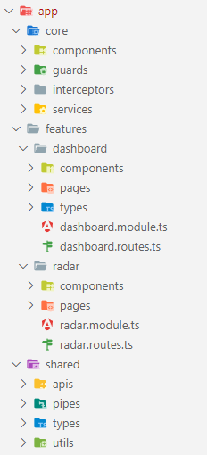
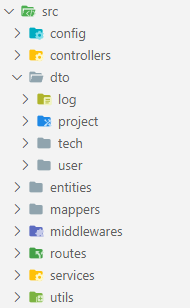

<a name="readme-top"></a>

[](https://github.com/go-hslu/weblab_project/actions/workflows/docker.yml)
[](https://github.com/go-hslu/weblab_project/actions/workflows/gh-pages.yml)
[](https://github.com/go-hslu/weblab_project/actions/workflows/markdown.yml)

<br/>
<div align="center">
  <a href="https://github.com/go-hslu/weblab_project">
    
  </a>

  <h3 align="center">WEBLAB Radar</h3>

  <p align="center">
    Hochschule Luzern, Modul WEBLAB (Web Programming Lab), Projektdokumentation
    <br/>
    <a href="https://github.com/go-hslu/weblab_project/issues">User Stories (Issues)</a>
    ·
    <a href="https://go-hslu.github.io/weblab_project/">GitHub Pages</a>
    ·
    <a href="https://github.com/orgs/go-hslu/packages">Docker image</a>
  </p>
</div>

## 1 Einführung und Ziele

Im Modul WEBLAB (Web Programming Lab) an der Hochschule soll ein Web-Projekt mit den behandelten Technologien erarbeitet werden. Die Projektartefakte sind auf dem [GitHub Repository](https://github.com/go-hslu/weblab_project) einsehbar.

Es wird die vorgeschlagene Projektidee eines [Technologie-Radars](https://www.thoughtworks.com/radar) verfolgt. Dabei ist das Ziel, dass innerhalb eines Unternehmens eine Übersicht auf die in Projekten verwendeten Technologien und Tools verschafft wird. In einer Visualisierung, ähnlich zu einem Radar, werden Technologien und Tools als Punkte dargestellt. Über die Quadranten beziehungsweise Sektoren werden diese kategorisiert (Frameworks, Tools, Languages, Platforms, Techniques) und über die nähe zur Mitte der Einsatz-Status (Hold, Assess, Trial, Adopt) angezeigt.


### 1.1 Aufgabenstellung

In Einzelarbeit soll mit einem totalen Aufwand von ca. 60 Stunden ein Web-Projekt realisiert werden. Die Artefakte aus dem Projekt zu 70% und Präsentation zu 30% ergeben die Modulnote. Gefordert werden folgende Inhalte:

**Projekt (70%)**
- Architekturdokumentation (35%)
- Fazit und Reflexion (20%)
- Arbeitsjournal (10%)
- Softwareartefakte (35%)

**Präsentation (30%)**
- Aufbau, Verständlichkeit (30%)
- Präsentationsartefakte (30%, Abgabe nach der Präsentation, Inhalt für 5 Minuten)
- Einhaltung der Timebox 5 Minuten (10%)
- Beantwortung Fragen (30%)

### 1.2 Qualitätsziele

- **Security**: Der Radar soll sowohl für Mitarbeiter (User) als auch Gäste (nicht-authentifiziert) verfügbar sein. Inhalte können nur von spezifischen Rollen (CTO, Tech-Lead, Admin) nach Authentifizierung mit E-Mail und Passwort verändert werden. Sensible Daten, wie das Passwort, werden nur gehashed abgespeichert.
- **Performance**: Die Inhalte werden unter Normalbedingungen (Kabelgebunden oder 5G) innert 1s geladen.
- **Usability**: Das UI ist für die Geräte Mobile und Desktop optimiert, sprich es wird auf Responsive-Design gesetzt. Verwendet wird ein schlichtes und übersichtliches Design mit auf der Plattform erwartbarem Verhalten (z.B Navigationsleiste hinter Hamburger-Icon auf Mobile).
- **Traceability**: Anpassungen an den Technologien werden historisiert und Anmeldungen auf der Adminseite protokolliert.

### 1.3 Team

| [<br/><sub>Gian Ott</sub>](https://www.linkedin.com/in/nichtgian/)<br/>Entwickler und Autor |
|---|


## 2 Kontextabgrenzung

Die [Anforderungen](https://github.com/web-programming-lab/web-programming-lab-projekt/blob/main/Technologie-Radar.md) der vorgeschlagenden Projektidee werden mehrheitlich übernommen. So sollen bestimmte Rollen (Tech-Lead, CTO und Admins) neue Technologien erfassen dürfen, und alle Mitarbeiter (User) die publizierten Technologien einsehen. 

### 2.1 Abgrenzungen / Änderungen

Prinzipiell wird von Grund auf eine eigene Lösung eines Technologie-Radars mit Hilfe von Web-Technologien erarbeitet. Dazu gehören das Fronted, Backend und die Persistierung. Kleinere Anpassungen, welche ich jedoch vornehmen möchte sind:
- **Projekte**: Projekte erfassen, und diesen Technologien zuordnen. Auf einem Radar könnte man so häufig verwendete Technologien als grössere Punkte darstellen.
- **Kategorien**: Die Kategorien, zu welchen Technologien zugeordnet werden, sollen die User selber festlegen können. Dies könnte bedeuten, dass im Radar mehr als vier Quadranten angezeigt würden.
- **Radar Visualisierung**: Den Radar werde ich aufgrund des grösseren Aufwands für eine Visualisierung nur als Tabelle darstellen.

### 2.2 Anforderungen (User Stories)

Folglich wurden die User Stories übernommen. Diese sind auf GitHub als [Issues](https://github.com/go-hslu/weblab_project/issues) hinterlegt. Hier eine Übersicht der User Stories samt Priorisierung nach MoSCoW:


| Id | User Story                                    | Priorität     | Status         |
|----|-----------------------------------------------|---------------|----------------|
| 01 | Anmelden Technologie-Radar-Administration     | 🟡 3. Could  | ✅ Done        |
| 02 | Technologie erfassen                          | 🔴 1. Must   | ✅ Done        |
| 03 | Technologie publizieren                       | 🟠 2. Should | ✅ Done        |
| 04 | Technologie ändern                            | 🟠 2. Should | ✅ Done        |
| 05 | Technologie-Einordnung ändern                 | 🟠 2. Should | 🎯 Todo        |
| 06 | Anmelden am Technologie-Radar-Viewer          | 🟡 3. Could  | ✅ Done        |
| 07 | Technologien anzeigen                         | 🔴 1. Must   | ✅ Done        |

Legende 1: MoSCoW-Priorisierung
- 🔴 1. Must
- 🟠 2. Should
- 🟡 3. Could
- 🟢 4. Won't

Legende 2: Umsetzungsstatus
- 🎯 Todo
- 🛠️ In progress
- ✅ Done

### 2.2 Technischer Kontext

In einem Frontend, dem Radar (Radar-App oder Radar Applikation), werden Technologie und Projekt Daten erfasst. Diese werden als JSON an eine REST API übermittelt und die entsprechende CRUD-Operation durchgeführt (Erstellen, Abfragen, Modifizieren oder Löschen).


## 3 Lösungsstrategie
### 3.1 Technologieentscheidungen


#### 3.1.1 TypeScript

Sowohl im Frontend als auch Backend wird strikt typisiert mit [TypeScript](https://www.typescriptlang.org/). Die explizite Typisierung sehe ich als grossen Vorteil gegenüber Vanilla JavaScript für einen leichter lesbareren Code.

#### 3.1.2 Angular (Frontend)

[Angular](https://angular.io/) ermöglicht das Erstellen von Single Page Applications. Es ist ein etabliertes und in der Schweiz sehr häufig verwendetes Framework.  Besonderer Vorteil mit Angular liegt in der Modularisierung, dem Routing beziehungsweise Router und dem (two-way-)Binding, was heute Standart in praktisch allen SPA-Frameworks (Vue.js, Svelte etc.) ist.

Ursprünglich hatte ich Angular 2 / Angular 4 um ca. 2017 in einem Tutorial/Video-Kurs kennengelernt. Neuere Features wie beispielsweise Signals kenne ich jedoch nicht. Da ich aber künftig bei meiner beruflichen Tätigkeiet unteranderem Angular einsetzten werde, möchte ich in diesem Projekt mein Wissen über Angular auffrischen und vertiefen. 

#### 3.1.3 Angular Material (CSS)

[Angular Material](https://material.angular.io/) liefert vorgefertigte UI Komponenten nach Material Design Optik. Die Integration mit Angular ist sehr einfach.

#### 3.1.4 Node / Express (Backend)

Im [Node](https://nodejs.org/en) Backend wird [Express](https://expressjs.com/) verwendet, um einfach APIs definieren zu können. 

#### 3.1.5 TypeORM / MySQL (ORM / Datenbank)

[TypeORM](https://typeorm.io/) nimmt einen Grossteil der Arbeit für die Persistierung ab. Es kann mit TypeORM (beziehungsweise generell mit OR-Mappern) eine Migration bei verändertem (DB-)Schema durchgeführt werden. Dies ist in der professionellen Entwicklung eine enorme Hilfe und erforderlich.

#### 3.1.6 JWT / Bcrypt (Authentication / Hashing)

Für die Authentifizierung beziehungsweise die Autorisierung (Zugriffssteuerung auf Ressourcen) werden [JSON Web Tokens](https://jwt.io/) eingesetzt. Dabei handelt es sich um eine "Token-based authentication", wofür keine Session eröffnet wird. Ein weiterer Vorteil ist, dass beispielsweise bei Social Media Plattformen registrierte Benutzer authentifiziert werden können. So müssen nicht die klassichen Anmeldeinformationmen Username und Passwort abgespeichert werden. Für die Implementierung im Backend wird Library [JWT](https://www.npmjs.com/package/jsonwebtoken) verwendet.

Das Passwort Hashing wird mit [Bcrypt](https://www.npmjs.com/package/bcrypt) umgesetzt.

#### 3.1.7 GitHub Actions / Vercel (CI/CD)

Änderungen (via Commit) lösen automatisch einen Build im [GitHub Repository](https://github.com/go-hslu/weblab_project) über GitHub Actions aus. In einer Pipeline wird das Frontend auf [GitHub Pages](https://go-hslu.github.io/weblab_project/) deployt. Eine weitere Pipeline löst einen Build eines Docker Images aus und deployt dieses als Package in die [GitHub Container Registry](https://github.com/orgs/go-hslu/packages).

Für die Projektabgabe versuche ich das Deployment mit dem Vorschlag [Vercel](https://vercel.com/) umzusetzten oder das Docker Image zur Verfügung zu stellen.

GitHub Actions möchte ich persönlich kennenlernen, da ich bis jetzt keine Erfahrung damit habe und ich darin einen grossen Nutzen für meine eigenen Repositories auf GitHub sehe. 


## 4 Bausteinsicht

Die Radar-App bezeichnet das Frontend, welches mit dem Backend über eine REST API kommuniziert. Das Datenaustauschformat ist JSON. 


### 4.1 Radar-App Frontend

Das Frontend ist die Benutzeroberfläche für Mitarbeiter und kommuniziert mit dem Backend.

### 4.2 Backend

Das Backend fungiert als API und Schnittstelle zur Datenbank. 

#### 4.2.1 Entitäts Diagramm

Die Entitäten für Technologien, Projekte und User sind wie folgt implementiert:


*Hinweis:* Dieses Diagramm ist eine Mischform aus ER und Klassendiagramm, da dies aufgrund der Implementierung sinnvoller scheint als eine strikte Einhaltung der UML-Notation.


## 5 Verteilungssicht 

Es ist eine lokale Entwicklungsumgebung **DEV** und das in einem Docker Container ausgelieferte Gesamtsystem **PROD** geplant.

### 5.1 DEV: Lokale Entwicklungsumgebung

Das Front- und Backend können in einer lokalen Entwicklungsumgebung gemäss Beschreibung im entsprechenden Projekt gestartet werden.

### 5.2 PROD: Docker Container

Das produktive System wird als Docker Container ausgeliefert. Dafür wird automatisiert via GitHub Actions ein Docker Image der Software gemäss `Dockerfile` in die GitHub Container Registry deployt. Nachfolgend wird über Docker Compose das Image aus der GitHub Container Registry zusammen mit einem vorgefertigten MySQL Image bezogen und das Zusammenspiel der Applikationen (radar-app und radar-db) im Container orchestriert. Die Konfiguration ist in der `docker-compose.yml` Datei zu finden.

1. Installiere und starte [Docker](https://www.docker.com/get-started/).
2. Starte den Container:
   ```sh
   docker-compose up
   ```
3. Warte auf die Ausgabe in der Kommandozeile `radar-app  | Starting Server.. (Database "radar@mysql")` beziehungsweise `radar-app  | Server running on http://localhost:8080` nach ca. 30 Sekunden.
4. Öffne den Browser mit folgender URL:
   ```sh
   http://localhost:8080
   ```

Die Datenbank wird automatisch mit Platzhalter-Daten via Dataseeding befüllt. Darunter sind folgende Benutzer:

| E-Mail            | Passwort | Rolle  |
|-------------------|----------|--------|
| **admin@hslu.ch** | 1234     | Admin  |
| **cto@hslu.ch**   | 1234     | CTO    |
| **user@hslu.ch**  | 1234     | USER   |

Admins, CTOs und TECH-LEADs haben vollständige Lese- und Schreibberechtigungen. Sie sehen alle, auch nicht-publizierte, Technologien.

User und nicht-authentifizierte Gäste können nur publizierte Technologien einsehen.

#### 5.2.1 Docker Container beenden

Beende den Container mit:
```sh
docker-compose down
```

#### 5.2.1 Docker Container force recreate

Sollte ein veralteter Stand über den latest Tag bezogen werden, kann wie folgt eine Aktualisierung erzwungen werden:
```sh
docker-compose pull
docker-compose up --force-recreate --build -d
```

#### 5.2.2 Docker Image

Aufgrund der Abhängigkeit zur MySQL Datenbank wird der Verbindungsaufbau zur Datenbank scheitern. Die Radar-App kann aber wie folgt isoliert bezogen und ausgeführt werden.

1. Beziehe das Docker Image von der GitHub Container registry:
   ```sh
   docker pull ghcr.io/go-hslu/weblab_project:latest
   ```
2. Erstelle einen Docker Container aus dem Image und führe diesen aus:
   ```sh
   docker run -p 8080:8080 -e SERVER_PORT=8080 ghcr.io/go-hslu/weblab_project:latest
   ```

## 6 Querschnittliche Konzepte
### 6.1 OR-Mapper / DTO und Entity

Intern im Backend werden Entities für den OR-Mapper definiert. Gegen aussen sollen aber nicht alle Attribute sichtbar sein, weshalb DTOs für die Nutzung gegen aussen definiert sind. Die Umwandlung von einem DTO zu Entity und umgekehrt findet via Mapper statt.


## 7 Architekturentscheidungen
### 7.1 Radar-App Frontend
#### 7.1.1 Strukturierung

Das Frontend wurde möglichst nach Angular Best-Practice strukturiert. Dazu gehören die drei Hauptpfade *core*, *features* und *shared*. 

Ein Feature kann aus Komponenten (*components*) und Seiten (*pages*) bestehen. Es kann eigene Typen enthalten und ist für das Routing innerhalb dieses Features zuständig.



### 7.2 Backend
#### 7.2.1 Strukturierung

Im Backend wird eine Anfrage prinzipiell via Route (z.B. GET Request /techs) empfangen. Via Middlewares wird die Authentifikation und Autorisierung geprüft. Die Logik befindet sich in einem Controller, welcher via Services auf die Datenbank zugreift. Dieser Zugriff wird über Repositories der jeweiligen Entities gesteuert.




## 8 Qualitätsanforderungen

Die Qualitätsanforderungen wurden im Abschnitt `1.2 Qualitätsziele` definiert.


## 9 Risiken und technische Schulden
### 9.1 offene TODOs
| Titel                    | Beschreibung                                                                                                                                                                                                                                                                                                  | Art     | Geschätzter Aufwand |
|--------------------------|---------------------------------------------------------------------------------------------------------------------------------------------------------------------------------------------------------------------------------------------------------------------------------------------------------------|---------|---------------------|
| Login / Logout reload    | Loggt sich ein User aus oder ein, wird die Komponente nicht neu geladen. Das "Sessioning" sollte generell verbessert werden. Dazu gehört das Beibehalten des Login Status wenn die Seite neugeladen wird, Zwischenspeichern des JWTs in einem Cookie und Router back statt auf die Home-Seite zu navigieren (temp fix). | Bug     | 2h                  |
| Projekte Funktionalität  | Funktionalität für Projekte: Projekte verwalten und verwendete Technologien zuweisen. Der Technologie-Punkt auf dem Radar wird grösser, wenn die Technologie oft eingesetzt wird.                                                                                                                             | Feature | 5h                  |
| MySQL caching_sha2       | Die aktuell verwendete Authentifizierung mit 'mysql_native_password' ist als *deprecated* markiert. Neu soll 'caching_sha2_password' verwendet werden.                                                                                                                                                        | Fix     | ~~1h~~              |
| Docker Compose condition | Das Backend ist abhängig von der Datenbank. Aktuell wird über einen temporären Fix ein Ping ausgeführt, welcher prüft, ob auf die Datenbank verbunden werden kann. Alternative (z.B. 'service_completed_successfully') funktioniert nicht.                                                                    | Fix     | 1h                  |
| Docker Compose Variablen | Die Umgebungvariabeln / Konfiguration kann über Placeholder gesetzt werden. Diese Variablen werden dann aus z.B. dem Repository ausgelesen und gesetzt. Wichtig bei komplettem Deployment des Containers.                                                                                                     | Fix     | 1h                  |
| Observable $ Notation    | Bei Observables den $-Zeichen Postfix ergänzen.                                                                                                                                                                                                                                                               | Improve | 30min               |


## 10 Reflexion

Im Rahmen des Moduls WEBLAB konnte ich mich intensiv mit Web-Technologien auseinandersetzen. In diesem Projekt vertiefte ich die in der Vorlesung angesprochenen Technologien und setzte mich mit anderen Themen auseinander, welche ich als spannend und nützlich empfand. Mir kam es auch so vor, als wäre diese individuelle Auseinandersetzung mit Web-Technologien ein gewolltes Ziel dieses Moduls und schätzte diese Freiheit sehr. Für eine Abgabe ein komplettes Front- und Backend umzusetzen, empfand ich als sehr motivierend. Der geforderte Zeitaufwand von 60 Stunden ist viel, empfand ich aber als persönlich realistisch, wenn gar ein wenig knapp für die Umsetzung aller Anforderungen. 

Ich bin mit dem Endergebnis sehr zufrieden. Die User Stories konnte ich grösstenteils realisieren, behielt es mir jedoch vor, nicht alle Details beispielsweise mit der Historisierung umzusetzen. Die Zeit nutzte ich dafür, um den Radar auch visuell darzustellen, ein schönes Backend mit OR-Mapper zu implementieren oder den Build- und Deployment Prozess mit GitHub Actions vollständig zu automatisieren. Im Frontend setzte ich Angular mit Angular Material ein. Dies auch aufgrund meiner neuen Anstellung seit Februar, bei der ich mit Angular arbeiten würde. In der Zwischenzeit konnte ich bereits das Wissen aus diesem Modul anwenden und sie in meine Arbeit einbringen. Im Backend setzte ich eine Menge verschiedener Frameworks ein. Die Dokumentation empfinde ich als gut gelungen und die Vorlage arc42 für Architektur Dokumentationen als hilfreich.

Aus administrativer Sicht war eine grosse Herausforderung die 60 Stunden Aufwand für Implementation und Dokumentation nebst Schule und Arbeit unterzubringen. Ich musste sehr früh, sprich bereits während der Blockwoche, beginnen. Schwierigkeiten hatte ich bei der Suche eines Problems in den teilweise mageren Dokumentationen. Konkret empfand ich Express.js, TypeORM und generell GitHub Actions überschaubar dokumentiert und dadurch schwer einzusteigen. Zuletzt ist das Projekt aus Zeitgründen und Mangels an Priorität an einigen Stellen noch nicht abgeschlossen. Ich habe meine offenen ToDo's mit einem Aufwand von knapp 10 Stunden geschätzt, wobei ich gerne noch die Zeit für die Umsetzung der Projekt-Funktionalität gehabt hätte.

Ich würde künftig hinsichtlich der Auswahl der Technologien einen richtigen Entscheid machen. Gerade im Backend habe ich nahezu zufällig Technologien ausgewählt. Beispielsweise würde ich heute NestJS statt Express.js für die API verwenden. Die Schnittstelle kann meiner Meinung nach viel raffinierter und auch syntaktisch schöner mittels Decorators definiert werden. Dies hätte ich bei einer richtigen Technologierecherche und einem Entscheid vermutlich herausgefunden. Mit TypeORM als OR-Mapper bin ich zufrieden, würde jedoch gerne einen Vergleich zu Prisma haben. In einem nächsten Web-Projekt würde ich gerne Svelte kennenlernen, bin mit Angular jedoch äusserst zufrieden. 

Angular ist ein mächtiges, vielseitiges und dadurch etabliertes SPA-Framework. Ich verstehe, wieso Angular in der Schweizer Webentwicklung so weit verbreitet ist.


## 11 Glossar
## 11.1 Abkürzungsverzeichnis

| Abkürzung [A-Z]       | Begriff                               |
|-----------------------|---------------------------------------|
| **CRUD**              | Create Read Update Delete             |
| **JWT**               | JSON Web Token                        |
| **REST**              | Representational State Transfer       |
| **SPA**               | Single Page Application               |

## 11.2 Technische- und Projektspezifische Begriffe

| Begriff [A-Z]                 | Definition und Beschreibung                                                                                                                                                                                                                                                                        |
|-------------------------------|----------------------------------------------------------------------------------------------------------------------------------------------------------------------------------------------------------------------------------------------------------------------------------------------------|
| **Angular**                   | Angular ist ein auf JavaScript basierendes Frontend-Web-Framework. Es wurde von Google entwickelt und ist aktuell in der Version 17. Es verfolgt den "Single Page Application"-Ansatz, wobei zuerst ein Grundgerüst der Webseite geladen wird und später nur noch Daten nachgeladen werden sollen. |
| **Bcrypt**                    | Bcrypt ist eine Hashfunktion für Passwörter. Gleichnamig heisst die passende npm Library.                                                                                                                                                                                                          |
| **Express**                   | Express.js ist ein JavaScript Backend-Framework für Node.js. Es erleichtert das Erstellen von (RESTful) APIs und WebServern.                                                                                                                                                                       |
| **GitHub Container Registry** | Über die GitHub Container Registry können (Docker) Images als Package verteilt werden. Diese sind über die URL `https://ghcr.io` abrufbar.                                                                                                                                                         |
| **GitHub Pages**              | GitHub Pages ermöglicht das Hosten von statischen Ressourcen (HTML, CSS und JavaScript) direkt auf dem Repository.                                                                                                                                                                                 |
| **JSON Web Token**            | Bei JWTs handelt es sich um Zugriff (Access)-Tokens. Über die Credentials wird der Zugriff auf Ressourcen gewährt (Authorization). Eine Besonderheit ist, dass keine Session auf dem Server eröffnet werden muss und stattdessen das übermittelte Token validiert wird.                            |
| **MySQL**                     | MySQL ist ein relationales DBMS (Database Management System).                                                                                                                                                                                                                                      |
| **Node**                      | Node.js ist eine plattformunabhängige JavaScript Laufzeitsumgebung (runtime environment). Über die V8 JavaScript engine kann somit JavaScript Code ausserhalb eines Browsers eingesetzt werden.                                                                                                    |
| **TypeORM**                   | TypeORM ist ein OR-Mapper und wird als Bindeglied zwischen der Datenbank (Relational) und dem objekt-orientiertem Backend verwendet.                                                                                                                                                               |
| **TypeScript**                | TypeScript fügt statische Typisierung und weitere Sprachkonstrukte zu JavaScript hinzu. TS wird zu JS transkompiliert.                                                                                                                                                                             |


## 12 Arbeitsjournal

| Datum              | Aufwand | Titel                                                         | Beschreibung                                                                                                                                                                                                                                                                                                                                                                                                                                                                                                                                                                                                                                                                                                                                                                                                                                                                                                                                                                     |
|--------------------|---------|---------------------------------------------------------------|----------------------------------------------------------------------------------------------------------------------------------------------------------------------------------------------------------------------------------------------------------------------------------------------------------------------------------------------------------------------------------------------------------------------------------------------------------------------------------------------------------------------------------------------------------------------------------------------------------------------------------------------------------------------------------------------------------------------------------------------------------------------------------------------------------------------------------------------------------------------------------------------------------------------------------------------------------------------------------|
| **Mo, 05.02.2024** | 2h      | Projektidee, Vorlage, GitHub Repository                       | Ich werde den Projektvorschlag des TechRadars verfolgen. Ich erstellte mir zunächst ein GitHub Repository und legte eine grobe Ordnerstruktur fest. Dokumentieren werde ich nach arc42, wofür ich die Vorlage (DE, 8.2) im Markdown-Format verwende und das README.md File ersetzte. Ich probierte zudem GitHub Actions aus, um den Build einer Angular Applikation zu automatisieren und die Webseite zu GitHub Pages zu deployen. Das Kontext Diagramm soll grob das System aufzeigen und das ER-Diagramm zeigt grob die geplanten Entitäten auf.                                                                                                                                                                                                                                                                                                                                                                                                                              |
| **Di, 06.02.2024** | 4h      | Node, Docker, GitHub Actions                                  | Festgelegt habe ich für das Frontend mit Angular und im Backend mit Node, Express (Web Server), TypeORM (OR-Mapper) und MySQL zu arbeiten. Sowohl im Frontend, als auch im Backend verwende ich TypeScript. Ich erstellte ein Dockerfile, um die gesamte Applikation als Docker Container einfach deployen zu können. Mit GitHub Actions werden sowohl die Angular Applikation gebuildet und in die GitHub Pages deployt als auch ein Docker Image mit Front- und Backend erstellt und in die der GitHub Container registry als Package verteilt.                                                                                                                                                                                                                                                                                                                                                                                                                                |
| **Mi, 07.02.2024** | 7h      | Dokumentation pdf, Projekt Check-In, Angular und API          | In einer GitHub Action wird aus der Dokumentation (README im Markdown Format) ein PDF generiert und als Artefakt gespeichert. Für die heutige Zwischenabgabe des Projekt-Check-Ins habe ich die geforderten Inhalte (User Stories, Tech-Stack) ergänzt. In Angular erstellte ich die Struktur, fügte Routing hinzu und definierte Services. Diese greifen bereits auf das Backend zu, welches vorläufig statisches JSON zurückgibt.                                                                                                                                                                                                                                                                                                                                                                                                                                                                                                                                              |
| **Do, 08.02.2024** | 6h      | Tech Table, TypeOrm Entities, Design                          | Ich installierte TypeOrm auf dem Backend und setzte es mit dem MySQL Driver auf. Für Techs, Projects, Users und Logs erstellte ich Entities gemäss dem ER Diagramm. Im Frontend erstellte ich mithilfe der Angular Material UI Komponenten eine Navigation (SideNav) und Footer. Für die Technologien erstellte ich ein Feature Modul. Die Techs werden über den TechService von der API mit einem TypeORM Repository von der DB geladen und als JSON übergeben. Dargestellt werden diese in einer Tabelle und ein Eintrag kann über die Detailansicht angesehen werden.                                                                                                                                                                                                                                                                                                                                                                                                         |
| **Fr, 09.02.2024** | 9h      | Authentifikation mit JWT, SeedData                            | Die Authentifizierung erfolgt nun über JWTs. Loggt sich ein User ein, werden auf dem Backend die Credentials überprüft. Es wird ein JWT Token zurückgegeben. Über einen Interceptor wird bei jedem Request dieses Token im Header mitgegeben. Wird eine Seite aufgerufen, welche eine besonderere Autorisierung benötigt (Rolle) wie für das Anpassen von Technologien, so wird das Token ausgelesen und die Rolle überprüft. Die Entities sind fertig und werden initial mit SeedData befüllt.                                                                                                                                                                                                                                                                                                                                                                                                                                                                                  |
| **Sa, 10.02.2024** | 10h     | UI Verbesserungen, API und Entity Attribute, Passwort hashing | In der Tabelle kann nun über ein Suchfeld nach Technologien gesucht und gefiltert werden. Diese Einträge lassen sich aufklappen, um die Beschreibung anzeigen zu lassen. Die Detailansicht und Löschfunktionalität sind hinter einem Editieren/Löschen-Button versteckt, welche nur berechtigen Usern angezeigt wird. Die Navigationsleiste ist für Desktop fixiert und für Mobile zusammenklappbar. Im Dashboard kann über Tabs zwischen Technologien und Projekten navigiert werden und Buttons haben nun einen Tooltip als Hilfestellung. Die Entities wurden mit allen (nötigen) Feldern gemäss User Story ergänzt. Das ganze Backend wurde restrukturiert und refactored. Ein Request wird über ein Route an einen Controller weitergeleitet, welche mit der DB über Services kommuniziert. Authentifizierung und Autorisierung wird über Middlewares gelöst. Das Passwort wird mit 'bcrypt' gehashed. In der Tabelle werden nicht publizierte Technologien gekennzeichnet. |
| **So, 11.02.2024** | 6h      | Technologien Erstellen, Publizieren und Update, SCSS          | Die Publizieren- und Editieren-Funktionalitäten wurden sowohl im Backend als auch Frontend implementiert. Bei Logins, Modifikationen (Create, Update/Publish) oder Löschen wird zudem ein Log entry erstellt und gespeichert. Ein "URL-Freundlicher" Name in TrainCase (train-case) Syntaxt wird generiert. Ich migrierte mit einem Tool von CSS zu SCSS und erstellte ein einfaches Theme mit grünem Farbschema.                                                                                                                                                                                                                                                                                                                                                                                                                                                                                                                                                                |
| **Mo, 12.02.2024** | 3h      | Radar visualisierung mit Canvas                               | Der Technologie Radar wird nun als Halbkreis visualisiert. Lediglich der Hintergrund ist statisch, die Sektoren (Abhängigkeit von Anzahl Kategorien) und States könnten dynamisch geändert, oder deren Farblabel gesetzt werden. Umgesetzt habe ich dies in einem HTML5 Canvas.                                                                                                                                                                                                                                                                                                                                                                                                                                                                                                                                                                                                                                                                                                  |
| **Mi, 21.02.2024** | 3h      | Diagramme und Styling Verbesserungen                          | Fertigstellung des Entitäts-, Architektur- und Kontextdiagramms. Aufbesserung der bisherigen Dokumentation (Formulierung, Gliederung). Die Technologie-Punkte sind innerhalb der Ränder, um die Visualisierung zu verbessern.                                                                                                                                                                                                                                                                                                                                                                                                                                                                                                                                                                                                                                                                                                                                                    |
| **Fr, 23.02.2024** | 2h      | Docker Container und Arbeit an Doku                           | Der Container ist nun einsatzbereit. Die Applikation wird als Image, welches automatisch deployt wird, bezogen und kommuniziert mit einem MySQL Image. Wie der Container gestartet wird ist dokumentiert und veraltete Teile aktualisiert. Offene ToDo's und technische Schulden habe ich geschätzt und dokumentiert. Die Reflexion fertiggestellt und Rechtschreibfehler korrigiert.                                                                                                                                                                                                                                                                                                                                                                                                                                                                                                                                                                                            |
| **Total:**         | 56h     |                                                               |                                                                                                                                                                                                                                                                                                                                                                                                                                                                                                                                                                                                                                                                                                                                                                                                                                                                                                                                                                                  |


**About arc42** Template Version 8.2, Januar 2023. 
Created, maintained and © by Dr. Peter Hruschka, Dr. Gernot Starke and contributors. View <https://arc42.org>.

<p align="right">(<a href="#readme-top">↑ zurück zum Anfang</a>)</p>