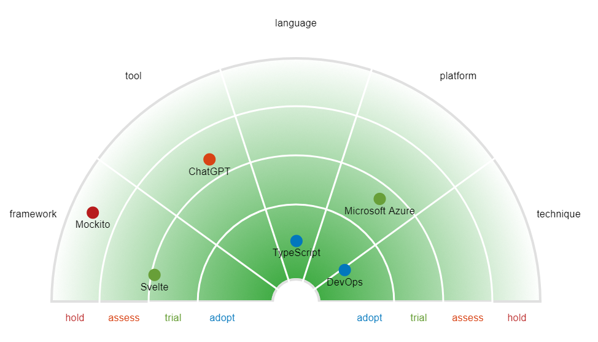
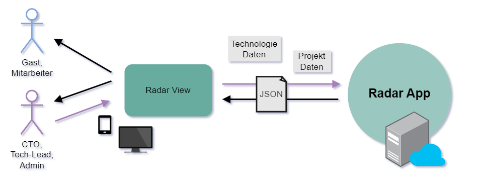
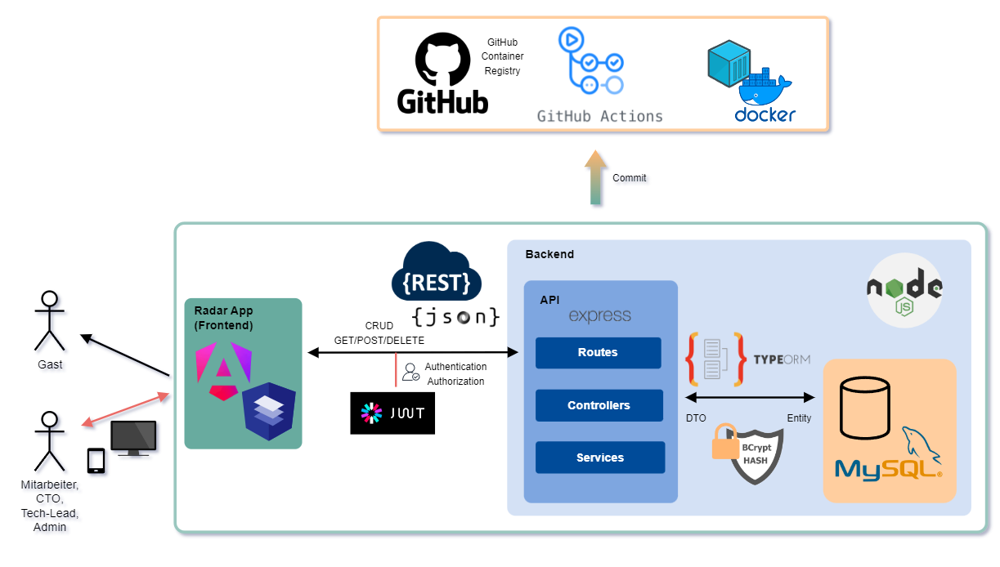
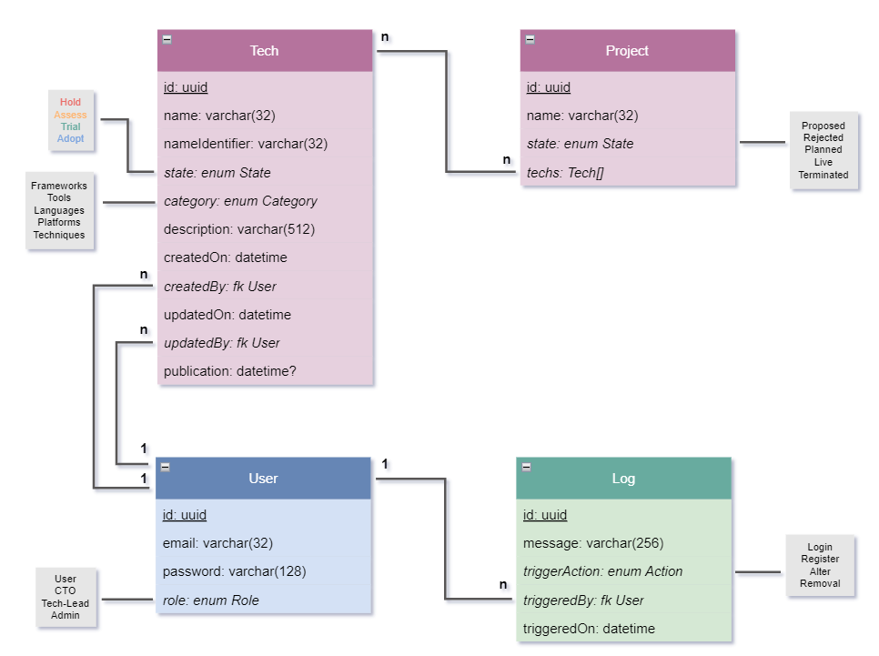

<a name="readme-top"></a>

[](https://github.com/go-hslu/weblab_project/actions/workflows/docker.yml)
[](https://github.com/go-hslu/weblab_project/actions/workflows/gh-pages.yml)
[](https://github.com/go-hslu/weblab_project/actions/workflows/markdown.yml)

<br/>
<div align="center">
  <a href="https://github.com/go-hslu/weblab_project">
    
  </a>

  <h3 align="center">WEBLAB Radar</h3>

  <p align="center">
    Hochschule Luzern, Modul WEBLAB (Web Programming Lab), Projektdokumentation
    <br/>
    <a href="https://github.com/go-hslu/weblab_project/issues">User Stories (Issues)</a>
    ·
    <a href="https://go-hslu.github.io/weblab_project/">GitHub Pages</a>
    ·
    <a href="https://github.com/orgs/go-hslu/packages">Docker image</a>
  </p>
</div>

## 1 Einführung und Ziele

Im Modul WEBLAB (Web Programming Lab) an der Hochschule soll ein Web-Projekt mit den behandelten Technologien erarbeitet werden. Die Projektartefakte sind auf dem [GitHub Repository](https://github.com/go-hslu/weblab_project) einsehbar.

Es wird die vorgeschlagene Projektidee eines [Technologie-Radars](https://www.thoughtworks.com/radar) verfolgt. Dabei ist das Ziel, dass innerhalb eines Unternehmens eine Übersicht auf die in Projekten verwendeten Technologien & Tools verschafft wird. In einer Visualisierung ähnlich zu einem Radar werden Technologien & Tools als Punkte dargestellt. Über die Quadranten/Sektoren werden diese kategorisiert (Frameworks, Tools, Languages, Platforms, Techniques) und über die nähe zur Mitte der Einsatz-Status (Hold, Assess, Trial, Adopt) angezeigt.



### 1.1 Aufgabenstellung

In Einzelarbeit soll mit einem totalen Aufwand von ca. 60 Stunden ein Web-Projekt realisiert werden. Die Artefakte aus dem Projekt zu 70% und Präsentation zu 30% ergeben die Modulnote. Gefordert werden folgende Inhalte:

**Projekt (70%)**
- Architekturdokumentation (35%)
- Fazit & Reflexion (20%)
- Arbeitsjournal (10%)
- Softwareartefakte (35%)

**Präsentation (30%)**
- Aufbau, Verständlichkeit (30%)
- Präsentationsartefakte (30%, Abgabe nach der Präsentation, Inhalt für 5 Minuten)
- Einhaltung der Timebox 5 Minuten (10%)
- Beantwortung Fragen (30%)

### 1.2 Qualitätsziele

- **Security**: Der Radar sowohl für Mitarbeiter (User) als auch Gäste (nicht-authentifiziert) verfügbar. Inhalte können nur von spezifischen Rollen (CTO, Tech-Lead, Admin) nach Authentifizierung mit E-Mail & Passwort verändert werden. Sensible Daten wie das Passwort werden nur gehashed abgespeichert.
- **Performance**: Die Inhalte werden unter Normalbedingungen (Kabelgebunden oder 5G) innert 1s geladen.
- **Usability**: Das UI ist für die Geräte Mobile & Desktop optimiert, sprich es wird auf Responsive-Design gesetzt. Verwendet ein schlichtes & übersichtliches Design mit auf dem Gerät erwartbarem Verhalten (z.B Navigationsleiste hinter Hamburger-Icon auf Mobile)
- **Traceability**: Anpassungen an den Technologien werden historisiert und Anmeldungen auf der Adminseite protokolliert.

### 1.3 Team

| [<br/><sub>Gian Ott</sub>](https://www.linkedin.com/in/nichtgian/)<br/>Entwickler & Autor |
|---|


## 2 Kontextabgrenzung

Die [Anforderungen](https://github.com/web-programming-lab/web-programming-lab-projekt/blob/main/Technologie-Radar.md) der vorgeschlagenden Projektidee werden mehrheitlich übernommen. So sollen bestimmte Rollen (Tech-Lead, CTO & Admins) neue Technologien erfassen dürfen, und alle Mitarbeiter (User) die publizierten Technologien einsehen. 

### 2.1 Abgrenzungen / Änderungen

Prinzipiell wird von Grund auf eine eigene Lösung eines Technologie-Radars mit Hilfe von Web-Technologien erarbeitet. Dazu gehören das Fronted, Backend und die Persistierung. Kleinere Anpassungen, welche ich jedoch vornehmen möchte sind:
- **Projekte**: Projekte erfassen, und diesen Technologien zuordnen. Auf einem Radar könnte man so häufig verwendete Technologien als grössere Punkte darstellen.
- **Kategorien**: Die Kategorien, zu welchen Technologien zugeordnet werden, sollen die User selber festlegen können. Dies könnte bedeuten, dass im Radar mehr als 4 Quadranten angezeigt würden.
- **Radar Visualisierung**: Den Radar werde ich aufgrund des grösseren Aufwands für eine Visualisierung nur als Tabelle darstellen.

### 2.2 Anforderungen (User Stories)

Folglich wurden die User Stories übernommen. Diese sind auf GitHub als [Issues](https://github.com/go-hslu/weblab_project/issues) hinterlegt. Hier eine Übersicht der User Stories samt priorisierung nach MoSCoW:


| Id | User Story                                    | Priorität     | Status         |
|----|-----------------------------------------------|---------------|----------------|
| 01 | Anmelden Technologie-Radar-Administration     | 🟡 3. Could  | ✅ Done        |
| 02 | Technologie erfassen                          | 🔴 1. Must   | ✅ Done        |
| 03 | Technologie publizieren                       | 🟠 2. Should | ✅ Done        |
| 04 | Technologie ändern                            | 🟠 2. Should | ✅ Done        |
| 05 | Technologie-Einordnung ändern                 | 🟠 2. Should | 🎯 Todo        |
| 06 | Anmelden am Technologie-Radar-Viewer          | 🟡 3. Could  | ✅ Done        |
| 07 | Technologien anzeigen                         | 🔴 1. Must   | ✅ Done        |

Legende 1: MoSCoW-Priorisierung
- 🔴 1. Must
- 🟠 2. Should
- 🟡 3. Could
- 🟢 4. Won't

Legende 2: Umsetzungsstatus
- 🎯 Todo
- 🛠️ In progress
- ✅ Done

### 2.2 Technischer Kontext

In einem Frontend, dem Radar (Radar-App oder Radar Applikation), werden Technologie & Projekt Daten erfasst. Diese werden als JSON an eine REST API übermittelt und die entsprechende CRUD-Operation durchgeführt (Erstellen, Abfragen, Modifizieren oder Löschen).




## 3 Lösungsstrategie
### 3.1 Technologieentscheidungen


#### 3.1.1 TypeScript

Sowohl im Frontend als auch Backend wird strikt typisiert mit [TypeScript](https://www.typescriptlang.org/). Die explizite Typisierung sehe ich als grossen Vorteil gegenüber Vanilla JavaScript für einen leichter lesbareren Code.

#### 3.1.2 Angular (Frontend)

[Angular](https://angular.io/) ermöglicht das Erstellen von Single Page Applications. Es ist ein etabliertes und in der Schweiz sehr häufig verwendetes Framework.  Besonderen Vorteil mit Angular liegt in der Modularisierung, dem Routing/Router und dem Binding (2-way), was heute Standart in praktisch allen SPA-Frameworks (Vue.js, Svelte etc.) ist.

Ich persönlich hatte ursprünglich Angular 2 / Angular 4 um ca. 2017 in einem Tutorial/Video-Kurs kennengelernt. Neuere Features wie Signals etc. kenne ich jedoch nicht. Da ich aber künftig bei der Arbeit auch Angular einsetzten werde, möchte ich in diesem Arbeit mein Wissen über Angular auffrischen und vertiefen. 

#### 3.1.3 Angular Material (CSS)

[Angular Material](https://material.angular.io/) liefert forgefertigte UI Komponenten nach Material Design Optik. Die Integration mit Angular ist sehr einfach.

#### 3.1.4 Node / Express (Backend)

Im [Node](https://nodejs.org/en) Backend wird [Express](https://expressjs.com/) verwendt, um einfach APIs definieren zu können. 

#### 3.1.5 TypeORM / MySQL (ORM & Database)

[TypeORM](https://typeorm.io/) nimmt einen Grossteil der Arbeit für die Persistierung ab. Es kann mit TypeORM (bzw. generell mit OR-Mappern) eine Migrationen bei verändertem (DB-)Schema durchgeführt werden. Dies ist in der professionellen Entwicklung eine enorme Hilfe.

#### 3.1.6 JWT Bcrypt (Authentication & Hashing)

Für die Authentifizierung bzw die Autorisierung (Zugriffssteuerung auf Ressourcen) werden [JSON Web Tokens](https://jwt.io/) eingesetzt. Dabei handelt es sich um eine "Token-based authentication", wofür keine Session eröffnet wird. Ein weiterer Vorteil ist, dass z.B. bei Social Media Plattformen registrierte Benutzer authentifiziert werden können. So müssen nicht die klassichen Anmeldeinformationmen Username-Passwort abgespeichert werden. Für die Implementierung im Backend wird Library [jsonwebtoken](https://www.npmjs.com/package/jsonwebtoken) verwendet.

Das Passwort hashing wird mit [Bcrypt](https://www.npmjs.com/package/bcrypt) umgesetzt.

#### 3.1.7 GitHub Actions / Vercel (CI/CD)

Änderungen (via Commit) lösen automatisch einen Build im [GitHub Repository](https://github.com/go-hslu/weblab_project) über GitHub Actions aus. In einer Pipeline wird das Frontend auf [GitHub Pages](https://go-hslu.github.io/weblab_project/) deployt. Eine weitere Pipeline löst einen Build eines Docker-Containers aus und deployt diesen als Package in die [GitHub Container Registry](https://github.com/orgs/go-hslu/packages).

Für die Projektabgabe versuche ich das Deployment mit dem Vorschlag [Vercel](https://vercel.com/) umzusetzten oder das Docker image zur Verfügung zu stellen.

GitHub Actions möchte ich persönlich kennenlernen, da ich bis jetzt keine Erfahrung mit GitHub Actions habe und ich darin einen grossen Nutzen für meine eigenen Projekte auf GitHub sehe. 


## 4 Bausteinsicht



<!--
Die Bausteinsicht zeigt die statische Zerlegung des Systems in Bausteine
(Module, Komponenten, Subsysteme, Klassen, Schnittstellen, Pakete,
Bibliotheken, Frameworks, Schichten, Partitionen, Tiers, Funktionen,
Makros, Operationen, Datenstrukturen, ...) sowie deren Abhängigkeiten
(Beziehungen, Assoziationen, ...)

Diese Sicht sollte in jeder Architekturdokumentation vorhanden sein. In
der Analogie zum Hausbau bildet die Bausteinsicht den *Grundrissplan*.
-->

### 4.1 Whitebox Gesamtsystem

<!--
An dieser Stelle beschreiben Sie die Zerlegung des Gesamtsystems anhand
des nachfolgenden Whitebox-Templates. Dieses enthält:

-   Ein Übersichtsdiagramm
-   die Begründung dieser Zerlegung
-   Blackbox-Beschreibungen der hier enthaltenen Bausteine. Dafür haben
    Sie verschiedene Optionen:
    -   in *einer* Tabelle, gibt einen kurzen und pragmatischen
        Überblick über die enthaltenen Bausteine sowie deren
        Schnittstellen.
    -   als Liste von Blackbox-Beschreibungen der Bausteine, gemäß dem
        Blackbox-Template (siehe unten). Diese Liste können Sie, je nach
        Werkzeug, etwa in Form von Unterkapiteln (Text), Unter-Seiten
        (Wiki) oder geschachtelten Elementen (Modellierungswerkzeug)
        darstellen.
-->

### 4.2 Entitäts Diagramm

Die Entitäten für Technologien, Projekte und User sind wie folgt implementiert:



*Hinweis:* Dieses Diagramm ist eine Mischform aus ER & Klassendiagramm, da dies aufgrund der Implementierung sinnvoller scheint als eine strikte Einhaltung der UML-Notation.


## 5 Verteilungssicht 

Es ist eine lokale Entwicklungsumgebung **DEV** und das in einem Docker-Container ausgelieferte Gesamtsystem **PROD** geplant.

### 5.1 DEV: Lokale Entwicklungsumgebung

Das Front- und Backend können in einer lokalen Entwicklungsumgebung gemäss Beschreibung im entsprechenden Projekt gestartet werden.

### 5.2 PROD: Docker-Container

Das Produktive System wird automatisch via GitHub Actions als Docker-Container in die GitHub Container Registry deployt.

1. Installiere und starte [Docker](https://www.docker.com/get-started/).
2. Beziehe das Docker image von der GitHub Container registry. 
   ```sh
   docker pull ghcr.io/go-hslu/weblab_project:latest
   ```
3. Erstelle einen Docker Container aus dem Image und führe diesen aus.
   ```sh
   docker run -p 8080:8080 -e SERVER_PORT=8080 ghcr.io/go-hslu/weblab_project:latest
   ```
4. Öffne den Browser mit folgender URL
   ```sh
   http://localhost:8080
   ```


## 6 Querschnittliche Konzepte

<!--
Dieser Abschnitt beschreibt übergreifende, prinzipielle Regelungen und
Lösungsansätze, die an mehreren Stellen (=*querschnittlich*) relevant
sind.

Solche Konzepte betreffen oft mehrere Bausteine. Dazu können vielerlei
Themen gehören, beispielsweise:
-   Modelle, insbesondere fachliche Modelle
-   Architektur- oder Entwurfsmuster
-   Regeln für den konkreten Einsatz von Technologien
-   prinzipielle --- meist technische --- Festlegungen übergreifender
    Art
-   Implementierungsregeln

Manche dieser Themen lassen sich nur schwer als Baustein in der
Architektur unterbringen (z.B. das Thema „Sicherheit").

Kann vielfältig sein:
-   Konzeptpapiere mit beliebiger Gliederung,
-   übergreifende Modelle/Szenarien mit Notationen, die Sie auch in den
    Architektursichten nutzen,
-   beispielhafte Implementierung speziell für technische Konzepte,
-   Verweise auf „übliche" Nutzung von Standard-Frameworks
    (beispielsweise die Nutzung von Hibernate als Object/Relational
    Mapper).

Eine mögliche (nicht aber notwendige!) Untergliederung dieses
Abschnittes könnte wie folgt aussehen (wobei die Zuordnung von Themen zu
den Gruppen nicht immer eindeutig ist):
-   Fachliche Konzepte
-   User Experience (UX)
-   Sicherheitskonzepte (Safety und Security)
-   Architektur- und Entwurfsmuster
-   Unter-der-Haube
-   Entwicklungskonzepte
-   Betriebskonzepte
-->


## 7 Architekturentscheidungen

### 7.1 

<!--
Wichtige, teure, große oder riskante Architektur- oder
Entwurfsentscheidungen inklusive der jeweiligen Begründungen. Mit
\"Entscheidungen\" meinen wir hier die Auswahl einer von mehreren
Alternativen unter vorgegebenen Kriterien.

Wägen Sie ab, inwiefern Sie Entscheidungen hier zentral beschreiben,
oder wo eine lokale Beschreibung (z.B. in der Whitebox-Sicht von
Bausteinen) sinnvoller ist. Vermeiden Sie Redundanz. Verweisen Sie evtl.
auf Abschnitt 4, wo schon grundlegende strategische Entscheidungen
beschrieben wurden.

Verschiedene Möglichkeiten:
-   ADR ([Documenting Architecture
    Decisions](https://cognitect.com/blog/2011/11/15/documenting-architecture-decisions))
    für jede wichtige Entscheidung
-   Liste oder Tabelle, nach Wichtigkeit und Tragweite der
    Entscheidungen geordnet
-   ausführlicher in Form einzelner Unterkapitel je Entscheidung
-->


## 8 Qualitätsanforderungen

Die Qualitätsanforderungen wurden im Abschnitt ```1.2 Qualitätsziele``` definiert.


## 9 Risiken und technische Schulden

<!--
Eine nach Prioritäten geordnete Liste der erkannten Architekturrisiken
und/oder technischen Schulden.
-->


## 10 Fazit & Reflexion
<!-- TODO -->


## 11 Glossar
## 11.1 Abkürzungsverzeichnis

| Abkürzung [A-Z]       | Begriff                               |
|-----------------------|---------------------------------------|
| **CRUD**              | Create Read Update Delete             |
| **JWT**               | JSON Web Token                        |
| **REST**              | Representational State Transfer       |
| **SPA**               | Single Page Application               |

## 11.2 Technische- und Projektspezifische Begriffe

| Begriff [A-Z]                 | Definition und Beschreibung                                                                                                                                                                                                                                                                        |
|-------------------------------|----------------------------------------------------------------------------------------------------------------------------------------------------------------------------------------------------------------------------------------------------------------------------------------------------|
| **Angular**                   | Angular ist ein auf JavaScript basierendes Frontend-Web-Framework. Es wurde von Google entwickelt und ist aktuell in der Version 17. Es verfolgt den "Single Page Application"-Ansatz, wobei zuerst ein Grundgerüst der Webseite geladen wird und später nur noch Daten nachgeladen werden sollen. |
| **Bcrypt**                    | Bcrypt ist eine Hashfunktion für Passwörter. Gleichnamig heisst die passende npm Library.                                                                                                                                                                                                          |
| **Express**                   | Express.js ist ein JavaScript Backend-Framework für Node.js. Es erleichtert das Erstellen von (RESTful) APIs und WebServern.                                                                                                                                                                       |
| **GitHub Container Registry** | Über die GitHub Container Registry können (Docker) Container als Package verteilt werden. Diese sind über die URL `https://ghcr.io` erreichbar.                                                                                                                                                       |
| **GitHub Pages**              | GitHub Pages ermöglicht das Hosten von statischen Resourcen (HTML, CSS & JavaScript) direkt auf dem Repository.                                                                                                                                                                                    |
| **JSON Web Token**            | Bei JWTs handelt es sich um Zugriff(Access)-Tokens. Über diese Credentials wird der Zugriff auf Resourcen gewährt (Authorization). Eine Besonderheit ist, dass keine Session auf dem Server eröffnet werden muss und stattdessen das übermittelte Token validiert wird.                            |
| **MySQL**                     | MySQL ist ein relationales DBMS (Database Management System).                                                                                                                                                                                                                                      |
| **Node**                      | Node.js ist eine plattformunabhängige JavaScript Laufzeitsumgebung (runtime environment). Über die V8 JavaScript engine kann somit JavaScript Code ausserhalb eines Browsers eingesetzt werden.                                                                                                    |
| **TypeORM**                   | TypeORM ist ein OR-Mapper und wird als Bindeglied zwischen der Datenbank (Relational) und dem objekt-orientiertem Backend verwendet.                                                                                                                                                               |
| **TypeScript**                | TypeScript fügt statische Typisierung und weitere Sprachkonstrukte zu JavaScript hinzu. TS wird immer zu JS transkompiliert.                                                                                                                                                                       |


## 12 Arbeitsjournal

| Datum              | Aufwand | Titel                                                       | Beschreibung                                                                                                                                                                                                                                                                                                                                                                                                                                                                                                                                                                                                                                                                                                                                                                                                                                                                                                                                                                   |
|--------------------|---------|-------------------------------------------------------------|--------------------------------------------------------------------------------------------------------------------------------------------------------------------------------------------------------------------------------------------------------------------------------------------------------------------------------------------------------------------------------------------------------------------------------------------------------------------------------------------------------------------------------------------------------------------------------------------------------------------------------------------------------------------------------------------------------------------------------------------------------------------------------------------------------------------------------------------------------------------------------------------------------------------------------------------------------------------------------|
| **Mo, 05.02.2024** | 2h      | Projektidee, Vorlage, GitHub Repository                     | Ich werde den Projektvorschlag des TechRadars verfolgen. Ich erstellte mir zunächst ein GitHub Repository und legte eine grobe Ordnerstruktur fest. Dokumentieren werde ich nach arc42, wofür ich die Vorlage (DE, 8.2) im Markdown-Format verwende und das README.md File ersetzte. Ich probierte zudem GitHub Actions aus, um den Build einer Angular Applikation zu automatisieren und die Webseite zu GitHub Pages zu deployen. Das Kontext Diagramm soll grob das System aufzeigen und das ER-Diagramm zeigt grob die geplanten Entitäten auf.                                                                                                                                                                                                                                                                                                                                                                                                                            |
| **Di, 06.02.2024** | 4h      | Node, Docker, GitHub Actions                                | Festgelegt habe ich für das Frontend mit Angular und im Backend mit Node, Express (Web Server), TypeORM (OR-Mapper) und MySQL zu arbeiten. Sowohl im Frontend, als auch im Backend verwende ich TypeScript. Ich erstellte ein Dockerfile, um die gesamte Applikation als Docker Container einfach deployen zu können. Mit GitHub Actions werden sowohl die Angular Applikation gebuildet und in die GitHub Pages deployt als auch ein Docker image mit Front- und Backend erstellt und in die der GitHub Container registry als Package verteilt.                                                                                                                                                                                                                                                                                                                                                                                                                              |
| **Mi, 07.02.2024** | 7h      | Dokumentation pdf, Projekt Check-In, Angular & API          | In einer GitHub Action wird aus der Dokumentation (README im Markdown Format) ein PDF generiert und als Artefakt gespeichert. Für die heutige Zwischenabgabe des Projekt-Check ins habe ich die geforderten Inhalte (User Stories, Tech-Stack) ergänzt. In Angular erstellte ich die Struktur, fügte Routing hinzu und definierte Services. Diese greifen bereits auf das Backend zu, welches vorläufig statisches JSON zurückgibt.                                                                                                                                                                                                                                                                                                                                                                                                                                                                                                                                            |
| **Do, 08.02.2024** | 6h      | Tech Table, TypeOrm Entities, Design                        | Ich installierte TypeOrm auf dem Backend und setzte es mit dem MySQL Driver auf. Für Techs, Projects, Users und Logs erstellte ich Entities gemäss dem ER Diagramm. Im Frontend erstellte ich mithilfe der Angular Material UI Komponenten eine Navigation (SideNav) und Footer. Für die Technologien erstellte ich ein Feature Modul. Die Techs werden über den TechService von der API mit einem TypeORM Repository von der DB geladen und als JSON übergeben. Dargestellt werden diese in einer Tabelle und ein Eintrag kann über die Detailansicht angesehen werden.                                                                                                                                                                                                                                                                                                                                                                                                       |
| **Fr, 09.02.2024** | 9h      | Authentifikation mit JWT, SeedData                          | Die Authentifizierung erfolgt nun über JWTs. Loggt sich ein User ein, werden auf dem Backend die Credentials überprüft. Es wird ein JWT Token zurückgegeben. Über einen Interceptor wird bei jedem Request dieses Token im Header mitgegeben. Wird eine Seite aufgerufen, welche eine besonderere Autorisierung benötigt (Rolle) wie für das Anpassen von Technologien, so wird das Token ausgelesen und die Rolle überprüft. Die Entities sind fertig und werden initial mit SeedData befüllt.                                                                                                                                                                                                                                                                                                                                                                                                                                                                                |
| **Sa, 10.02.2024** | 10h     | UI Verbesserungen, API & Entity Attribute, Passwort hashing | In der Tabelle kann nun über ein Suchfeld nach Technologien gesucht & gefiltert werden. Diese Einträge lassen sich aufklappen, um die Beschreibung anzeigen zu lassen. Die Detailansicht und Löschfunktionalität sind hinter einem Editieren/Löschen-Button versteckt, welche nur berechtigen Usern angezeigt wird. Die Navigationsleiste ist für Desktop fixiert und für Mobile zusammenklappbar. Im Dashboard kann über Tabs zwischen Technologien und Projekten navigiert werden und Buttons haben nun einen Tooltip als Hilfestellung. Die Entities wurden mit allen (nötigen) Feldern gemäss User Story ergänzt. Das ganze Backend wurde restrukturiert und refactored. Ein Request wird über ein Route an einen Controller weitergeleitet, welche mit der DB über Services kommuniziert. Authentifizierung und Autorisierung wird über Middlewares gelöst. Das Passwort wird mit 'bcrypt' gehashed. In der Tabelle werden nicht publizierte Technologien gekennzeichnet. |
| **So, 11.02.2024** | 6h      | Technologien Erstellen, Publizieren & Update, SCSS          | Die Publizieren und Editieren Funktionalitäten wurde sowohl im Backend als auch Frontend implementiert. Bei Logins, Modifikationen (Create, Update/Publish) oder Löschen wird zudem ein Log entry erstellt und gespeichert. Ein "URL-Freundlicher" Name in TrainCase (train-case) Syntaxt wird generiert. Ich migrierte mit einem Tool von CSS zu SCSS und erstellte ein einfaches Theme mit grünem Farbschema.                                                                                                                                                                                                                                                                                                                                                                                                                                                                                                                                                                |
| **Mo, 12.02.2024** | 3h      | Radar visualisierung mit Canvas                             | Der Technologie Radar wird nun als Halbkreis visualisiert. Lediglich der Hintergrund ist statisch, die Sektoren (Abhängigkeit von Anzahl Kategorien) und States könnten dynamisch geändert, oder deren Farblabel gesetzt werden. Umgesetzt habe ich dies in einem HTML5 Canvas.                                                                                                                                                                                                                                                                                                                                                                                                                                                                                                                                                                                                                                                                                                |
| **Mi, 21.02.2024** | 3h      | Diagramme & Styling Verbesserungen                          | Fertigstellung des Entitäts-, Architektur- und Kontextdiagramms. Aufbesserung der bisherigen Dokumentation (Formulierung, Gliederung). Radar Technologie Punkte Ränder, um Visualisierung zu verbessern.                                                                                                                                                                                                                                                                                                                                                                                                                                                                                                                                                                                                                                                                                                                                                                       |
| **Total:**         | 50h     |                                                             |                                                                                                                                                                                                                                                                                                                                                                                                                                                                                                                                                                                                                                                                                                                                                                                                                                                                                                                                                                                |


**About arc42** Template Version 8.2, Januar 2023. 
Created, maintained and © by Dr. Peter Hruschka, Dr. Gernot Starke and contributors. View <https://arc42.org>.

<p align="right">(<a href="#readme-top">↑ zurück zum Anfang</a>)</p>